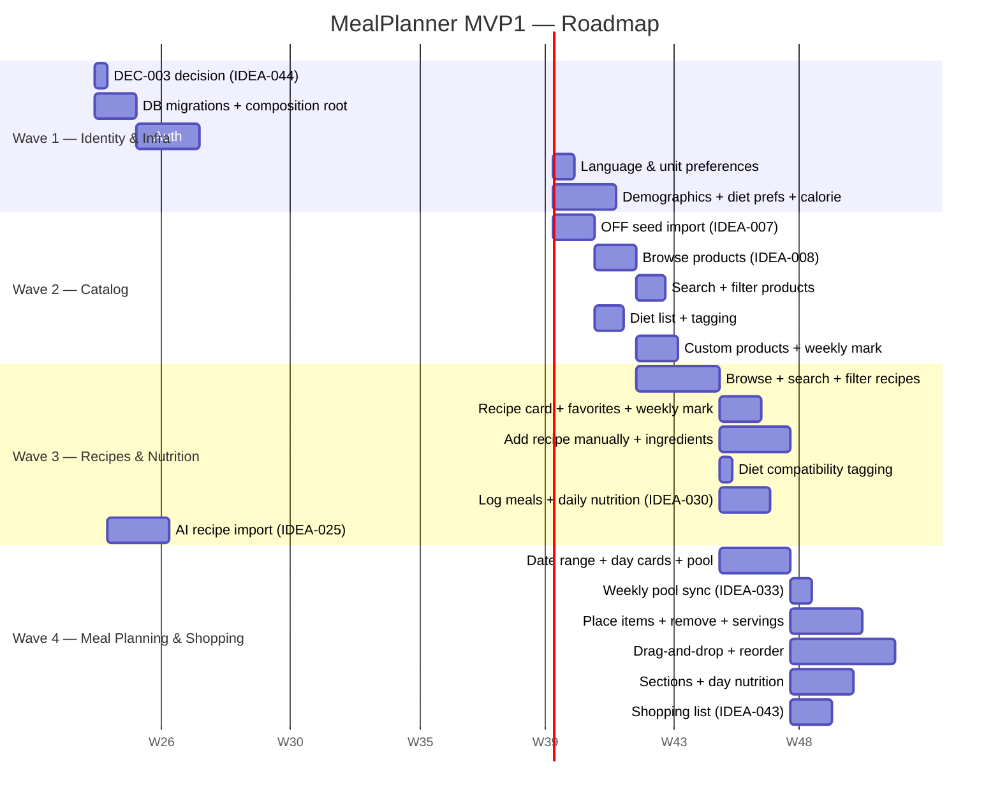

# Product Roadmap — MealPlanner MVP1

_Generated: 2026-06-15_  
_Stage: early-mvp · Methodology: RICE for feature, WSJF for enabler, FIFO for ops_  
_Source: `meta/kanban/backlog-scored.yml`_

---

## Capacity Allocation (early-mvp defaults)

| Category | % | Note |
|----------|--:|------|
| feature | 80 | |
| enabler | 15 | |
| tech-debt | 0 | deferred at early-mvp |
| compliance | 0 | deferred at early-mvp |
| ops | 5 | incidents only |

> **Note on Waves 1–2:** enablers (auth, DB migrations, OFF import) exceed their 15% budget in the first two waves because they are architectural foundations that nothing else can build on. This is expected and intentional — capacity normalises to ~80/15/5 from Wave 3 onwards.

---

## Wave 1 — Identity & Infrastructure  (~9.5 person-weeks)

**Goal:** Working auth, user profile, and DB schema for all four contexts. Nothing else can start without this wave.

### enabler  (5.5 pw / 1.4 pw nominal budget — overrun justified, see note above)

| Rank | ID | Idea | WSJF | Effort | Depends |
|------|----|------|-----:|-------:|---------|
| 1 | IDEA-044 | Resolve DEC-003: recipe import sync vs. async (ADR) | 26.0 | 0.5 pw | — |
| 2 | IDEA-002 | DB migrations + composition-root wiring | 6.8 | 2 pw | — |
| 3 | IDEA-001 | User registration and sign-in with email/password | 4.875 | 3 pw | IDEA-002 |

> **IDEA-044 first:** It has no code and costs 0.5 pw. Resolving DEC-003 now prevents a forced rework decision mid-Increment 3.

### feature  (4 pw / 7.6 pw budget — underrun; remaining capacity held for Wave 2)

| Rank | ID | Idea | RICE | Effort | Depends |
|------|----|------|-----:|-------:|---------|
| 4 | IDEA-003 | Language preference setting | 100 | 0.5 pw | IDEA-001 |
| 5 | IDEA-004 | Unit system preference (metric / imperial) | 100 | 0.5 pw | IDEA-001 |
| 6 | IDEA-006 | Diet preferences and calorie corridor configuration | 80 | 2 pw | IDEA-001 |
| 7 | IDEA-005 | Demographic and body metrics profile | 80 | 1 pw | IDEA-001 |

---

## Wave 2 — Catalog: Products & Dietary Tagging  (~10.5 person-weeks)

**Goal:** Browsable product catalog seeded from OpenFoodFacts, dietary data, and the weekly-marking integration pin.

### enabler  (2 pw / 1.6 pw budget — slight overrun, OFF import is load-bearing)

| Rank | ID | Idea | WSJF | Effort | Depends |
|------|----|------|-----:|-------:|---------|
| 8 | IDEA-007 | OpenFoodFacts seed import CLI job | 4.8 | 2 pw | IDEA-001 |

### feature  (8.5 pw / 8.4 pw budget — on target)

| Rank | ID | Idea | RICE | Effort | Depends |
|------|----|------|-----:|-------:|---------|
| 9 | IDEA-009 | Filter products by category | 180 | 0.5 pw | IDEA-008 |
| 10 | IDEA-010 | Search for a product | 180 | 1 pw | IDEA-008 |
| 11 | IDEA-014 | View list of supported diets | 160 | 0.5 pw | IDEA-007 |
| 12 | IDEA-008 | Browse products with nutrition breakdown | 135 | 2 pw | IDEA-007 |
| 13 | IDEA-013 | Mark a product for the current week | 128 | 1 pw | IDEA-008 |
| 14 | IDEA-015 | Diet description and macro guidance | 70 | 0.5 pw | IDEA-014 |
| 15 | IDEA-012 | Edit or delete own products | 56 | 1 pw | IDEA-011 |
| 16 | IDEA-011 | Add a custom product | 56 | 1 pw | IDEA-008 |
| 17 | IDEA-016 | Mark product compatibility with a diet | 56 | 1 pw | IDEA-014 |

> IDEA-008 must be implemented before IDEA-009/010/011/013 (topo order). IDEA-014 before IDEA-015/016.

---

## Wave 3 — Recipes & Nutrition Tracking  (~17 person-weeks)

**Goal:** Full recipe catalog with search and filtering, manual + AI import, daily meal logging, and nutrition aggregation.

### feature  (17 pw / ~13.6 pw budget — overrun; no enablers in Wave 3, roll budget)

> Enabler budget (15%) rolls to features — all Wave 3 work is feature.

| Rank | ID | Idea | RICE | Effort | Depends |
|------|----|------|-----:|-------:|---------|
| 18 | IDEA-023 | Mark recipe for the current week | 256 | 0.5 pw | IDEA-017 |
| 19 | IDEA-018 | Filter recipes by category | 160 | 0.5 pw | IDEA-017 |
| 20 | IDEA-019 | Filter favorites or own recipes | 160 | 0.5 pw | IDEA-017 |
| 21 | IDEA-021 | Search for a recipe | 160 | 1 pw | IDEA-017 |
| 22 | IDEA-026 | Open recipe card (full detail view) | 160 | 1 pw | IDEA-017 |
| 23 | IDEA-017 | Browse recipes with nutrition + ingredients | 120 | 2 pw | IDEA-008 |
| 24 | IDEA-020 | Filter recipes by diet | 112 | 0.5 pw | IDEA-017 |
| 25 | IDEA-029 | Mark recipe compatibility with a diet | 96 | 0.5 pw | IDEA-017 |
| 26 | IDEA-022 | Mark recipe as favorite | 80 | 0.5 pw | IDEA-017 |
| 27 | IDEA-028 | Edit recipe ingredients | 74.7 | 1.5 pw | IDEA-027 |
| 28 | IDEA-030 | Log meals and view daily nutrition summary | 67.2 | 2.5 pw | IDEA-017 |
| 29 | IDEA-024 | Add a recipe manually | 56 | 2 pw | IDEA-017 |
| 30 | IDEA-027 | Edit or delete own recipes | 56 | 1 pw | IDEA-017 |
| 31 | IDEA-025 | Import a recipe from external sources (AI) | 20 | 3 pw | IDEA-044 |

> IDEA-017 must be implemented before IDEA-018/019/020/021/022/023/024/026/027/028/029/030. IDEA-027 before IDEA-028.  
> ⚠ IDEA-025 confidence=0.5 because DEC-003 was resolved in Wave 1 — confirm the ADR decision before sizing this story.

---

## Wave 4 — Meal Planning & Shopping List  (~20 person-weeks)

**Goal:** Weekly planning canvas, summary pool, drag-and-drop, day nutrition, and shopping list generation.

### feature  (20 pw / ~16 pw budget — overrun; no enablers, roll budget)

| Rank | ID | Idea | RICE | Effort | Depends |
|------|----|------|-----:|-------:|---------|
| 32 | IDEA-031 | Choose planning date range | 120 | 0.5 pw | IDEA-001 |
| 33 | IDEA-033 | Weekly-marked items auto-populate summary pool | 96 | 1 pw | IDEA-023, IDEA-032 |
| 34 | IDEA-040 | Remove items from day cards and sync to summary | 64 | 1.5 pw | IDEA-037 |
| 35 | IDEA-043 | Generate or refresh shopping list | 66 | 2 pw | IDEA-032 |
| 36 | IDEA-042 | Day card nutrition summary (per-day aggregate) | 64 | 1.5 pw | IDEA-032 |
| 37 | IDEA-037 | Place items from summary pool onto specific days | 64 | 1.5 pw | IDEA-032 |
| 38 | IDEA-041 | Set servings per dish per day | 48 | 1 pw | IDEA-037 |
| 39 | IDEA-032 | Day cards + summary pool UI | 48 | 3 pw | IDEA-031 |
| 40 | IDEA-039 | Select and assign items without drag-and-drop | 44 | 1 pw | IDEA-032 |
| 41 | IDEA-036 | Configure sections on day cards | 44 | 1 pw | IDEA-035 |
| 42 | IDEA-034 | Build summary pool with drag-and-drop | 32 | 3 pw | IDEA-032 |
| 43 | IDEA-035 | Organize summary into menu sections | 29.3 | 1.5 pw | IDEA-032 |
| 44 | IDEA-038 | Reorder items across days and sections | 22 | 2 pw | IDEA-037 |

> Implementation order (topo): IDEA-031 → IDEA-032 → IDEA-033/034/035/037/039/042/043 → IDEA-036/040/041 → IDEA-038  
> ⚠ **IDEA-040 (remove + sync)** is the highest-risk story in Wave 4. Handoff notes INV-012 and INV-013 are most likely to produce edge-case bugs — prioritise acceptance test coverage here.

---

## All Ranked Ideas

| Rank | Wave | ID | Idea | Cat | Score | Effort | Status |
|------|------|----|------|-----|------:|-------:|--------|
| 1 | 1 | IDEA-044 | Resolve DEC-003 (recipe import decision) | enabler | 26.0 | 0.5 pw | backlog |
| 2 | 1 | IDEA-002 | DB migrations + composition-root wiring | enabler | 6.8 | 2 pw | backlog |
| 3 | 1 | IDEA-001 | User registration and sign-in | enabler | 4.875 | 3 pw | backlog |
| 4 | 1 | IDEA-003 | Language preference | feature | 100 | 0.5 pw | backlog |
| 5 | 1 | IDEA-004 | Unit system preference | feature | 100 | 0.5 pw | backlog |
| 6 | 1 | IDEA-006 | Diet preferences & calorie corridor | feature | 80 | 2 pw | backlog |
| 7 | 1 | IDEA-005 | Demographic & body metrics profile | feature | 80 | 1 pw | backlog |
| 8 | 2 | IDEA-007 | OpenFoodFacts seed import | enabler | 4.8 | 2 pw | backlog |
| 9 | 2 | IDEA-009 | Filter products by category | feature | 180 | 0.5 pw | backlog |
| 10 | 2 | IDEA-010 | Search for a product | feature | 180 | 1 pw | backlog |
| 11 | 2 | IDEA-014 | View list of supported diets | feature | 160 | 0.5 pw | backlog |
| 12 | 2 | IDEA-008 | Browse products with nutrition | feature | 135 | 2 pw | backlog |
| 13 | 2 | IDEA-013 | Mark product for current week | feature | 128 | 1 pw | backlog |
| 14 | 2 | IDEA-015 | Diet description & macro guidance | feature | 70 | 0.5 pw | backlog |
| 15 | 2 | IDEA-012 | Edit / delete own products | feature | 56 | 1 pw | backlog |
| 16 | 2 | IDEA-011 | Add a custom product | feature | 56 | 1 pw | backlog |
| 17 | 2 | IDEA-016 | Mark product / diet compatibility | feature | 56 | 1 pw | backlog |
| 18 | 3 | IDEA-023 | Mark recipe for current week | feature | 256 | 0.5 pw | backlog |
| 19 | 3 | IDEA-018 | Filter recipes by category | feature | 160 | 0.5 pw | backlog |
| 20 | 3 | IDEA-019 | Filter favorites / own recipes | feature | 160 | 0.5 pw | backlog |
| 21 | 3 | IDEA-021 | Search for a recipe | feature | 160 | 1 pw | backlog |
| 22 | 3 | IDEA-026 | Recipe card detail view | feature | 160 | 1 pw | backlog |
| 23 | 3 | IDEA-017 | Browse recipes with nutrition | feature | 120 | 2 pw | backlog |
| 24 | 3 | IDEA-020 | Filter recipes by diet | feature | 112 | 0.5 pw | backlog |
| 25 | 3 | IDEA-029 | Mark recipe / diet compatibility | feature | 96 | 0.5 pw | backlog |
| 26 | 3 | IDEA-022 | Mark recipe as favorite | feature | 80 | 0.5 pw | backlog |
| 27 | 3 | IDEA-028 | Edit recipe ingredients | feature | 74.7 | 1.5 pw | backlog |
| 28 | 3 | IDEA-030 | Log meals & daily nutrition summary | feature | 67.2 | 2.5 pw | backlog |
| 29 | 3 | IDEA-024 | Add a recipe manually | feature | 56 | 2 pw | backlog |
| 30 | 3 | IDEA-027 | Edit / delete own recipes | feature | 56 | 1 pw | backlog |
| 31 | 3 | IDEA-025 | Import recipe (AI-backed) | feature | 20 | 3 pw | backlog |
| 32 | 4 | IDEA-031 | Choose planning date range | feature | 120 | 0.5 pw | backlog |
| 33 | 4 | IDEA-033 | Weekly items auto-populate pool | feature | 96 | 1 pw | backlog |
| 34 | 4 | IDEA-040 | Remove items & sync to summary ⚠ | feature | 64 | 1.5 pw | backlog |
| 35 | 4 | IDEA-043 | Generate / refresh shopping list | feature | 66 | 2 pw | backlog |
| 36 | 4 | IDEA-042 | Day card nutrition summary | feature | 64 | 1.5 pw | backlog |
| 37 | 4 | IDEA-037 | Place items onto days | feature | 64 | 1.5 pw | backlog |
| 38 | 4 | IDEA-041 | Set servings per dish per day | feature | 48 | 1 pw | backlog |
| 39 | 4 | IDEA-032 | Day cards + summary pool UI | feature | 48 | 3 pw | backlog |
| 40 | 4 | IDEA-039 | Select items without drag-and-drop | feature | 44 | 1 pw | backlog |
| 41 | 4 | IDEA-036 | Configure sections on day cards | feature | 44 | 1 pw | backlog |
| 42 | 4 | IDEA-034 | Build summary with drag-and-drop | feature | 32 | 3 pw | backlog |
| 43 | 4 | IDEA-035 | Organize summary into menu sections | feature | 29.3 | 1.5 pw | backlog |
| 44 | 4 | IDEA-038 | Reorder items across days & sections | feature | 22 | 2 pw | backlog |

**Total estimated effort: ~57 person-weeks across 4 waves**

---

## Gantt (dependency order)

---

## Wave effort summary

| Wave | Scope | Enabler pw | Feature pw | Total pw |
|------|-------|----------:|----------:|---------:|
| 1 | Identity + infra | 5.5 | 4.0 | **9.5** |
| 2 | Catalog | 2.0 | 8.5 | **10.5** |
| 3 | Recipes + nutrition | 0 | 17.0 | **17.0** |
| 4 | Meal planning + shopping | 0 | 20.0 | **20.0** |
| **Total** | | **7.5** | **49.5** | **57.0** |

---

## Next step

Run `/forge:kanban` to convert Wave 1 ideas into CARD-NNN cards and start tracking progress.  
Or run `/forge:architect` to validate that the architecture trace still covers all 44 backlog ideas.
